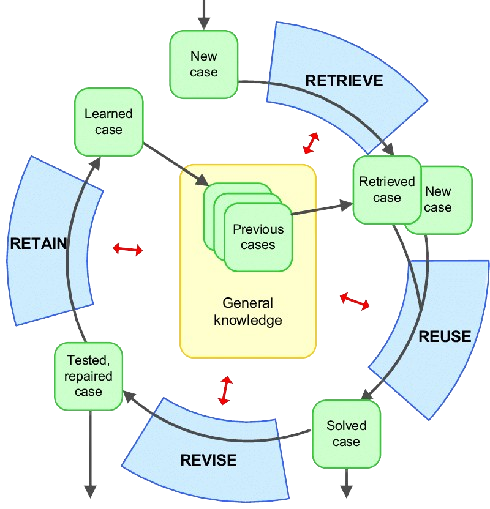

<!-- 

 -->

## Pendahuluan

Cek Cabai App, adalah aplikasi yang dirancang untuk mendukung petani dalam mendiagnosis penyakit tanaman cabai yang mereka hadapi. Aplikasi ini memungkinkan petani untuk mengidentifikasi penyakit tanaman cabai secara akurat berdasarkan gejala yang diamati pada tanaman mereka. Dengan informasi yang diberikan oleh aplikasi, petani dapat mengambil langkah-langkah yang tepat untuk mengelola dan mengendalikan penyakit, sehingga meningkatkan hasil panen dan meminimalkan kerugian.

<!-- ## Cara Menggunakan Cek Cabai App

Dalam apliaksi Cek Cabai App terdapat 3 role utama diantaranya adalah ( Admin, Pakar, dan Petani )

### Admin
Merupakan role yang diberikan untuk 

- CRUD semua data user

### Pakar Tanaman Cabai
Meruakan role yang diberikan terhadap orang yang memiliki pengetahuan lebih terhadap tanaman cabai yang juga sudah terjamin dan terpilih untuk dapat memegang role tersebut.   

Pakar disini akan bertugas sebagai orang yang akan melakukan kontrol terhadap berbagai pengetahuan yang tersedia didalam aplikasi mulai dari :

- Jenis Gejala,
- Jenis Penyakit besertakan cara penanganan,
- Menentukan suatu penyakit dapat disebabkan oleh gejala apa saja,
- Melakukan revisi pengetahuan berdasarkan kasus baru yang diberikan oleh para petani.

Pakar tanaman cabai akan diberikan hak akses untuk dapat melakukan berbagai hal seperti:

- CRUD Gejala Tanaman Cabai
- CRUD Penyakit Tanaman Cabai
- CRUD Kasus Tanaman Cabai

### Petani Tanaman Cabai -->

## Cara Kerja Aplikasi

Aplikasi ini merupakan sistem pendukung keputusan klinis yang dikembangkan dengan menerapkan konsep dari metode Case Based Reasoning (CBR), yang dipadukan dengan Certainty Factor (CF).

---

### Case Based Reasoning

Case Based Reasoning memiliki 4 tahapan penting yaitu (Retrieve, Reuse, Revise, Retain) :

#### Retrieve
Merupakan tahapan di mana kasus baru akan diberikan ke dalam basis data, dengan proses sebagai berikut:

- Petani melakukan input gejala yang mereka alami.
- Aplikasi melakukan perhitungan untuk mencari tingkat kemiripan gejala yang dialami petani dengan kasus-kasus terdahulu.

#### Reuse
Merupakan tahapan di mana sistem akan mengambil data yang memiliki tingkat kemiripan tertinggi, dengan proses sebagai berikut:

- Sistem menentukan kasus terdahulu mana yang paling mirip dengan kasus terbaru.
- Sistem mengambil data kasus yang memiliki tingkat kepercayaan tertinggi untuk diberikan kepada petani sebagai referensi diagnosis penyakit tanaman cabai beserta cara penanganannya.
- Sistem akan menyimpan data kasus yang memiliki tingkat kepercayaan tertinggi sebagai tambahan untuk mendukung basis pengetahuan.

#### Revise
Merupakan tahapan di mana kasus-kasus yang baru saja diberikan oleh petani akan dilakukan pengecekan oleh pakar, untuk mengetahui apakah hasil diagnosis dari aplikasi tersebut sudah benar atau belum, dengan proses sebagai berikut:

- Pakar akan memberikan tingkat keyakinan terhadap tiap gejala di kasus yang dipilih.
- Sistem akan melakukan perhitungan, berdasarkan pernyataan pakar, apakah kasus tersebut valid untuk langsung dimasukkan ke dalam basis pengetahuan atau tidak.
- Jika hasil dari sistem "VALID", maka pakar hanya perlu menambahkan bobot kepercayaan terhadap gejala yang belum teridentifikasi bobot kepercayaannya.
- Jika hasil dari sistem "Tidak Valid", maka pakar perlu menentukan berdasarkan gejala-gejala yang diterima pada kasus tersebut merupakan diagnosis penyakit tanaman cabai apa.
- Pakar juga perlu menambahkan bobot kepercayaan terhadap gejala yang belum teridentifikasi bobot kepercayaannya.

#### Retain
Merupakan tahapan di mana kasus yang telah diperbaiki oleh pakar akan disimpan ke dalam basis data, dan akan dijadikan tambahan basis pengetahuan untuk menangani kasus-kasus yang akan datang.

---

### Certainty Factor

Metode ini digunakan untuk menghitung tingkat keyakinan seorang pakar terhadap kasus baru yang muncul, berdasarkan pengetahuan pakar tentang pengaruh suatu gejala terhadap suatu penyakit.
